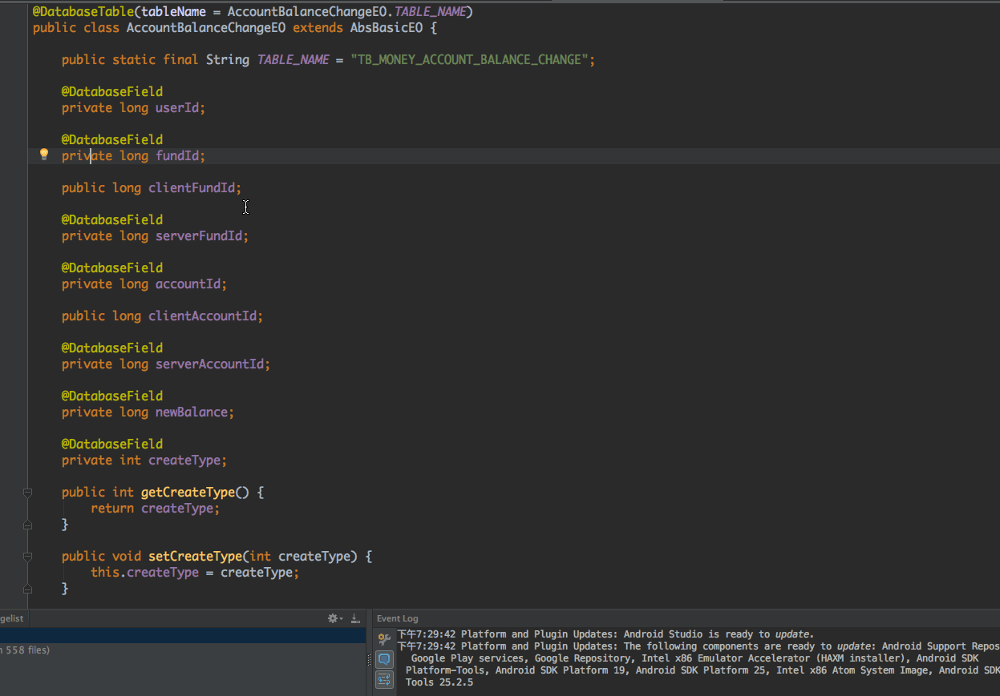

# android-ormlite-rawsql-generator

This plugin generates raw insert and update sql of ormlite class for you.

## Installation

- [download it](https://github.com/andyken/android-ormlite-rawsql-generator/blob/master/RawSqlGenerator.jar) and install via `Preferences → Plugins → Install plugin from disk`

## Usage

1.Right click on the ormlite class, then `Generate` and `Generate Raw Sql of ormlite class`
2.Pick fields you want, you also have an option to include fields from the super class.
3.Click `Confirm`.